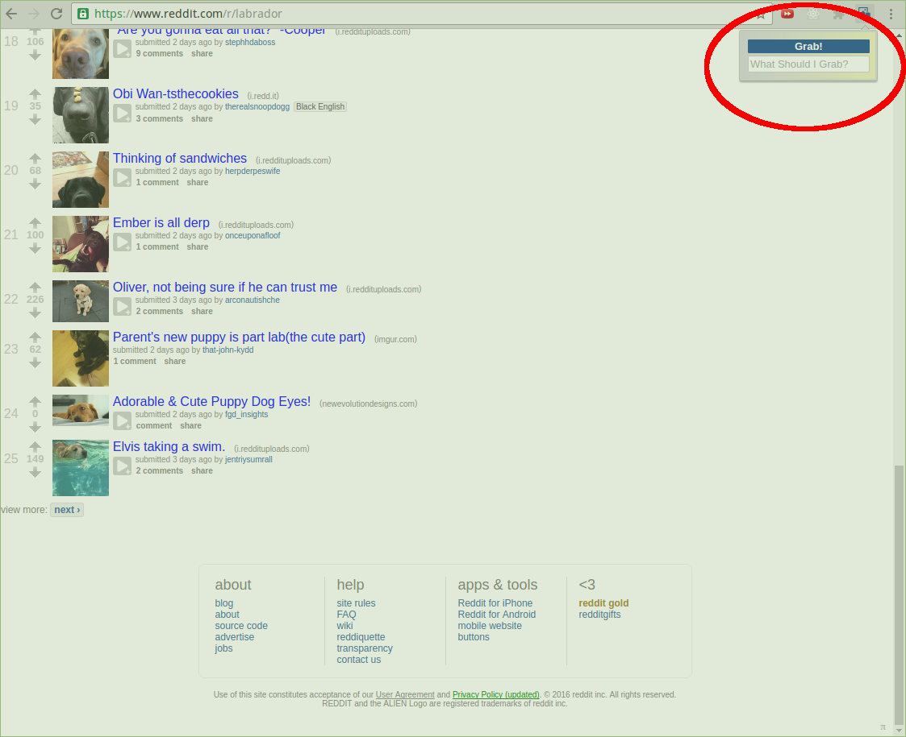

# Grab 'n Tag

Available now in the [Chrome Store](https://chrome.google.com/webstore/detail/grab-n-tag/kmogilfibnkhjchkcojfafcnddbcpdeb)

Grab 'n Tag is a Chrome extension that enables batch downloading and automatic naming of images on a webpage according to the individual image content.

## Features

Grab 'n Tag makes use a form of machine learning known as an Artificial Neural Network (ANN) to analyze images on the web-page. The ANN is trained to be highly accurate by feeding it large volumes of sample data, in this case, images which have already been tagged with for their content. Once trained, the ANN analyzes individual images and returns lists of tags that it believes are associated with them.
Our own ANN server is in development so in the meantime Grab 'n Tag makes use of [Clarifai](https://www.clarifai.com/)'s image recognition API to get tags associated with images.
Grab 'n Tag features a non-intrusive input and submit form for users to enter search terms to filter their batch download by.


### Structure and Function
Grab 'n Tag's code is split mainly between 4 files:
- popup.html
    - contains the html for the form which is the only user interface.
- popup.js
    - manages click events from submission of the form and sends the appropriate messages to the other components.
- background.js
    - holds most of the functionality - responsible for API calls and filtering
- content.js
    - obtains DOM information to send to the other scripts as needed

When a user clicks 'Grab!' `content.js` first identifies all images on the current tab:
```
function imageFind() {
  let imgs = document.getElementsByTagName("img");
  [].slice.call(imgs).forEach((img) => {
    if(img.parentNode.nodeName === "A"){
      chrome.runtime.sendMessage({text: "crawl", content: {href: img.parentNode.href, url: img.src}})
    } else {
      chrome.runtime.sendMessage({text: "get-tags", content: img.src})
    }
  })
}
```
and sends them to `background.js` via `chrome.runtime.sendMessage`. `background.js` sends the images via `$.ajax` to ANN for processing. It receives back a list of tags for each image and the probabilities associated with those tags' accuracy.

Next `background.js` filters out results which did not match the user's search terms:
```
function tagMatchesExist(tagArray){
  let matches = false
  if (typeof(tagFilter) === 'undefined' || tagFilter.toLowerCase() === "all"){
    matches = true
  }
  tagArray.forEach((tag) => {
    if(tag === tagFilter){
      matches = true
    }
  })
  return matches
}
```
Finally `background.js` downloads the matching images and names them according to the returned tag with the highest match probability:

```
function downloadIfMatched(responseObject){
  let url = responseObject.results[0].url
  let tags = responseObject.results[0].result.tag.classes
  if(tagMatchesExist(tags)){
    let downloadData = {}
    downloadData.url = url
    downloadData.filename = tags[0]
    chrome.downloads.download(downloadData)
  }
}
```

## Future Improvements
- Self built ANN server using TensorFlow to identify image content
- Image Crawler
    - Currently in development is web crawler functionality which would follow links for images to find full resolution version of the image on the page. Current implementations (sending GET requests to links that wrap images and parsing the response) proved unworkable due to inconsistency in landing pages accessed by following the links. Additionally such a solution is slow because it must wait for responses for each image crawled. This problem is an interesting one and will require some thorough filtration of response data and possibly additional image recognition checks to identify the proper image.
- Blocking duplicate downloads
    - The working plan is to save a list of already downloaded image taggings for a given page as a cookie, and if the returned list of taggings all match a saved list, to skip the download
